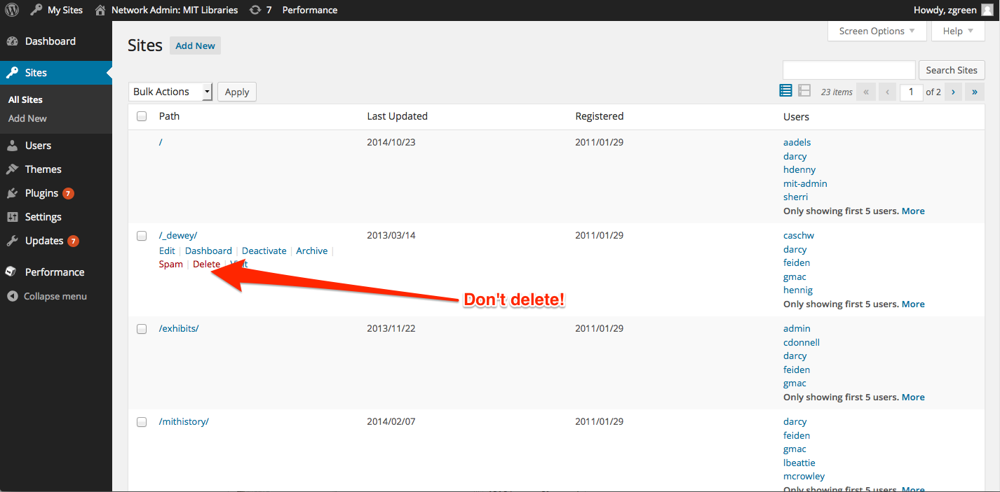

# Deleting sites from the multisite network

In the WordPress Network admin dashboard, there is [a page which presents super admins with the option to delete sites from the multisite network](//libraries.mit.edu/wp-admin/network/sites.php). Don't do this! There is a bug in our current version of WordPress that will cause the contents of the `/wp-content/uploads/` folder to be deleted whenever a single site is deleted from the multisite network.

It's a good idea to periodically test for this issue on a development version of the site to see if the issue has been fixed.

Sites in the multisite network may be safely deactivated, however.

.